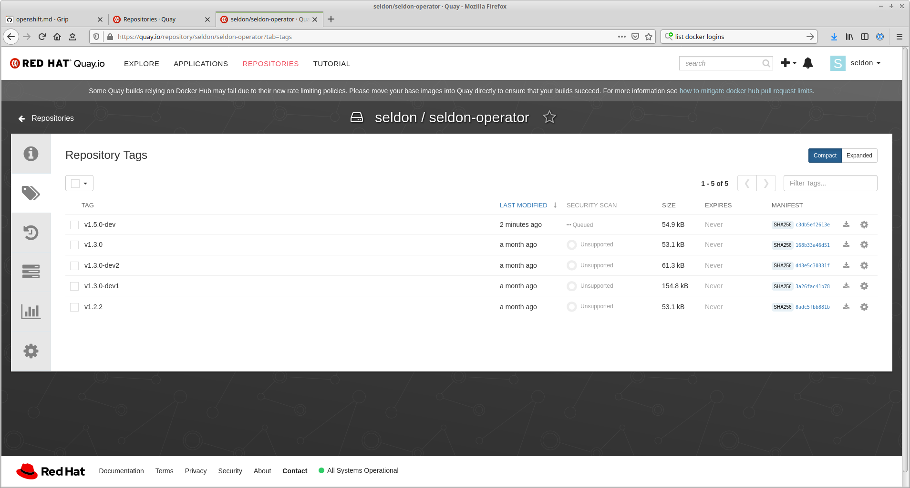

# RedHat Operator Release Steps

## Summary

*Run this in branch of released version not in master*

We presently still use the v1beta1 CRD. At some point we need to convert to the v1 CRD. However this CRD is too large for operator-registry (it converts the CRD to a configmap and it hits configmap limit it seems). We therefore might need to move forward with just v1 version for the v1 CRD and remove v1alpha2 and v1alpha3 versions of the SeldonDeployment CRD. See https://github.com/operator-framework/operator-registry/issues/385

There are also fixes in crd and crd_v1 configs for https://github.com/kubernetes/kubernetes/issues/91395 under a patch called protocol.yaml

We also remove the `owned` versions for v1alpha2 and v1alpha3 using `hack/csv_hack.py` to fix community test lint failures. This maybe actually be an issue in `operator-courier verify`.

## Prerequisites

### Operastor-SDK

Install [operator-sdk](https://sdk.operatorframework.io/).


```
operator-sdk version
operator-sdk version: "v1.2.0", commit: "215fc50b2d4acc7d92b36828f42d7d1ae212015c", kubernetes version: "v1.18.8", go version: "go1.15.3", GOOS: "linux", GOARCH: "amd64"
```


### OPM

Install [opm](https://docs.openshift.com/container-platform/4.6/cli_reference/opm-cli.html#opm-cli). I used docker instead of podman to install.

```
opm version
Version: version.Version{OpmVersion:"1.12.3", GitCommit:"", BuildDate:"2020-09-18T09:16:12Z", GoOs:"linux", GoArch:"amd64"}
```

### Operator-Courier

See [https://github.com/operator-framework/operator-courier](here).

```
operator-courier -v
2.1.10
```

### Quay

Login to quay.io as seldon. Password in 1password. 


## Version Update


 * Update Makefile and change PREV_VERSION.
 * Update `opm_index` in Makefile to include previous version
 * Update `opm_index_certified` in Makefule to include previous version
 * Update `packagemanifests/Makefile` `create_bundles` and `push_bundles` to include last version
 * Update `packagemanifests-certified/Makefile` `create_bundles` and `push_bundles` to include last version 


```bash
make update_openshift
```

Updated image should be available in quay.io (https://quay.io/signin)




## Scorecard

```bash
kind create cluster
```

Run scorecard

```bash
make scorecard
```

## Tests

Run [kind cluster tests](./openshift/tests/README.md#local-kind-cluster). k8s >= 1.16.

Run [Openshift cluster tests](./openshift/tests/README.md#openshift-cluster). Openshift >= 4.3.

## Community and Upstream Operators

Will need to be run in release branch

Create a fork of https://github.com/operator-framework/community-operators

Create a PR for community operator

Update the Makefile locally for 

```
COMMUNITY_OPERATORS_FOLDER=~/work/seldon-core/redhat/community-operators
```

### Community Operator

Create a branch for update in above fork. e.g.:

```
git checkout -b 1.7.0_community
```

```
make update_community
```

To test, you will need Ansible >= 2.9 installed. Follow [instructions](https://operator-framework.github.io/community-operators/), e.g.

```
bash <(curl -sL https://cutt.ly/WhkV76k)   kiwi,lemon,orange community-operators/seldon-operator/1.6.0
```

Example output:

```
Info: No labels defined
debug=0
Using ansible 2.9.18 on host ...

One can do 'tail -f /tmp/op-test/log.out' from second console to see full logs

Checking for kind binary ...
 [ Preparing testing container 'op-test' from 'quay.io/operator_testing/operator-test-playbooks:latest' ]
 Test 'kiwi' for 'community-operators seldon-operator 1.6.0' ...
 [kiwi] Reseting kind cluster ...
 [kiwi] Running test ...
 ansible-playbook -i localhost, -e ansible_connection=local upstream/local.yml -e run_upstream=true -e image_protocol='docker://' -vv -e container_tool=podman -e run_prepare_catalog_repo_upstream=false -e operator_dir=/tmp/community-operators-for-catalog/community-operators/seldon-operator -e operator_version=1.6.0 --tags pure_test -e operator_channel_force=optest -e test_skip_deploy=true -e strict_mode=true
 Test 'kiwi' : [ OK ]

Test 'lemon' for 'community-operators seldon-operator 1.6.0' ...
[lemon] Reseting kind cluster ...
[lemon] Running test ...
ansible-playbook -i localhost, -e ansible_connection=local upstream/local.yml -e run_upstream=true -e image_protocol='docker://' -vv -e container_tool=podman -e run_prepare_catalog_repo_upstream=false -e operator_dir=/tmp/community-operators-for-catalog/community-operators/seldon-operator --tags deploy_bundles -e strict_mode=true

```

Add new folder and changed package yaml to a PR. Ensure you sign the commit.

```
git commit -s -m "Update Seldon Community Operator to 1.7.0"
```

Push and create PR.

### Upstream Operator

Create a branch for update in above fork. e.g.:

```
git checkout -b 1.7.0_upstream
```

```
make update_upstream
```

Run tests


To test, you will need Ansible >= 2.9 installed. Follow [instructions](https://operator-framework.github.io/community-operators/), e.g.

```
cd ${COMMUNITY_OPERATORS_FOLDER}
bash <(curl -sL https://cutt.ly/WhkV76k)   kiwi,lemon,orange upstream-community-operators/seldon-operator/1.6.0
```

```
Info: No labels defined
debug=0
Using ansible 2.9.18 on host ...

One can do 'tail -f /tmp/op-test/log.out' from second console to see full logs

Checking for kind binary ...
 [ Preparing testing container 'op-test' from 'quay.io/operator_testing/operator-test-playbooks:latest' ]
 Test 'kiwi' for 'upstream-community-operators seldon-operator 1.6.0' ...
 [kiwi] Reseting kind cluster ...
 [sudo] password for clive:
 [kiwi] Running test ...
 ansible-playbook -i localhost, -e ansible_connection=local upstream/local.yml -e run_upstream=true -e image_protocol='docker://' -vv -e container_tool=podman -e run_prepare_catalog_repo_upstream=false -e operator_dir=/tmp/community-operators-for-catalog/upstream-community-operators/seldon-operator -e operator_version=1.6.0 --tags pure_test -e operator_channel_force=optest -e strict_mode=true
 Test 'kiwi' : [ OK ]

Test 'lemon' for 'upstream-community-operators seldon-operator 1.6.0' ...
[lemon] Reseting kind cluster ...
[lemon] Running test ...
ansible-playbook -i localhost, -e ansible_connection=local upstream/local.yml -e run_upstream=true -e image_protocol='docker://' -vv -e container_tool=podman -e run_prepare_catalog_repo_upstream=false -e operator_dir=/tmp/community-operators-for-catalog/upstream-community-operators/seldon-operator --tags deploy_bundles -e strict_mode=true
```

Ensure you sign the commit, e.g.:

```
git commit -s -m "Update Seldon Upstream Operator to 1.7.0"
```

## Certified Operators

Update `packagemanifests-certified/Makefile` to include build and push for previous version.

Create new package and push to quay for testing

```
make update_openshift_certified
```

Push all images to redhat. requires download of passwords from 1password to `~/.config/seldon/seldon-core/redhat-image-passwords.sh`

```
cd {project_base_folder}/marketplaces/redhat
python scan-images.py
```

After these are finished (approx 1.5 hours) you will need to manually publish images on https://connect.redhat.com/projects

publish

 * https://connect.redhat.com/project/5912261/view
 * https://connect.redhat.com/project/5912271/view
 * https://connect.redhat.com/project/5912311/view
 * https://connect.redhat.com/project/5912301/view
 * https://connect.redhat.com/project/1366481/view
 * https://connect.redhat.com/project/1366491/view
 * https://connect.redhat.com/project/3977851/view
 * https://connect.redhat.com/project/3986991/view
 * https://connect.redhat.com/project/3987291/view
 * https://connect.redhat.com/project/3993461/view
 * https://connect.redhat.com/project/4035711/view


Run [Openshift cluster tests](./openshift/tests/README.md#openshift-cluster-certified). Openshift >= 4.3.


Push bundle image to scanning and tests. Also needs passwords.

```
make bundle_certified_push
```

This will start a test of the package in RedHat. Log on to check its success. If it fails you will need to manually delete in UI and build, tag and push a new version.

Check: https://connect.redhat.com/project/5892531/images


## Prepare for next release

Update base config version for next release

```
make update_config
```

